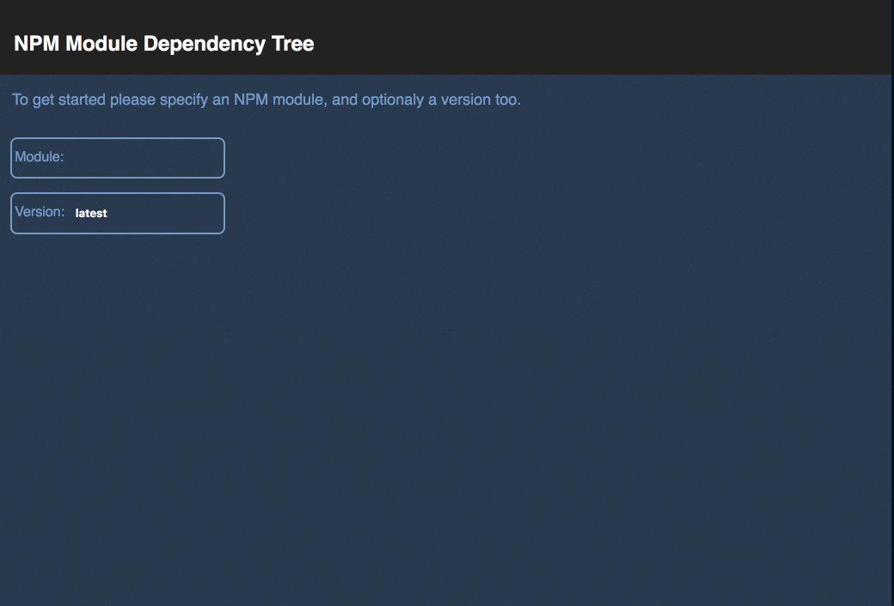

Hi :)

I've put this project together in a few hours as a submission for the interview.

It's not quite my best work, as I just threw it together, but the broad idea is this:
  * There is a Restify based service which spwans a GET endpoint on port 8050 and fetches the NPM module's dependencies.
  * There is very basic caching in the service using memoization. This means cache is limitted to a single Node instance and run... not ideal, but hey, we're all about minimum steps to value, right?
  * There is a basic React web app (with very basic tests... time constraints and all) which fetches the specified module depenencies using the service.
  * You can drill deep into the dependencies of each dependency as you inspect a module.
  * The two projects are stitched together using Lerna which I;ve used for many mono-repo projects and allows you to interact with multiple packages at one.




## Scripts

### `npm start`

Runs the app & the service in development mode.<br>
it opens [http://localhost:3000](http://localhost:3000) to view it in the browser and launches the service on [http://localhost:8050/meze/latest](http://localhost:8050/meze/latest).

### `npm test`

Runs Jest to test both the service & app. CRA launches Jest in watch mode, so it won't actually give proper output through Lerna.
To see the actual test results you'll want to run `npm t` in the specific package folder.

```sh
cd ./packages/npm-depenendency-tree-viewer
npm t
```
